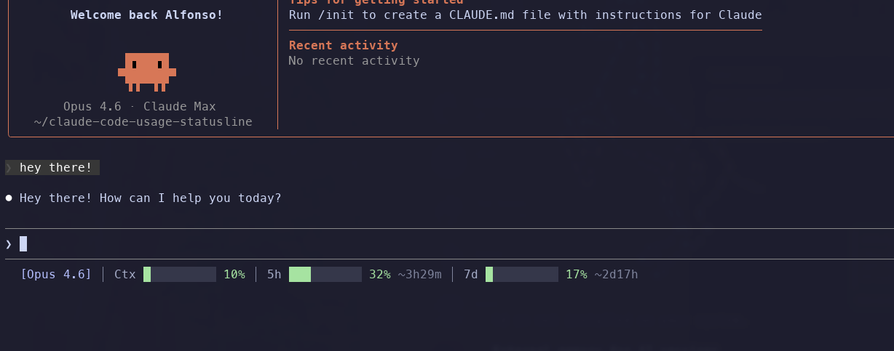

# Claude Code Usage Status Line

A [Claude Code](https://docs.anthropic.com/en/docs/claude-code) status line plugin that displays your **Claude Pro subscription usage** directly in the CLI — session limits, weekly limits, and reset times, all at a glance.



```
[Opus] │ Ctx ████░░░░░░ 42% │ 5h █░░░░░░░░░ 16% ~4h30m │ 7d █░░░░░░░░░ 14% ~2d23h
```

## Features

- **Pro usage tracking** — 5-hour session and 7-day weekly utilization percentages
- **Reset countdowns** — time remaining until each limit resets
- **Context window** — current context window usage from Claude Code
- **Color-coded bars** — green → yellow → orange → red as usage increases
- **Zero dependencies** — pure Python stdlib, no `pip install` needed
- **Multiple themes** — Catppuccin Mocha/Latte, Tokyo Night, Gruvbox, or plain ANSI

## Requirements

- **Python 3.8+**
- **Claude Code** v2.1+ (provides rate limit data via stdin)

## Installation

### Homebrew (recommended)

```bash
brew install victorstein/tap/claude-usage-statusline
```

`post_install` automatically configures `~/.claude/settings.json` — no manual setup needed.

### Manual

```bash
mkdir -p ~/.claude/scripts
curl -fsSL https://raw.githubusercontent.com/victorstein/claude-code-usage-statusline/main/claude-usage-statusline.py \
  -o ~/.claude/scripts/claude-usage-statusline.py
chmod +x ~/.claude/scripts/claude-usage-statusline.py
```

Then add to `~/.claude/settings.json`:

```json
{
  "statusLine": {
    "type": "command",
    "command": "python3 ~/.claude/scripts/claude-usage-statusline.py"
  }
}
```

## Usage

1. Start (or restart) a Claude Code session
2. Send a message — the status line appears at the bottom after the first response

### What the numbers mean

| Segment | Description |
|---------|-------------|
| `[Opus]` | Current model |
| `Ctx 42%` | Context window utilization |
| `5h 16% ~4h30m` | 5-hour rolling session usage, resets in 4h 30m |
| `7d 14% ~2d23h` | 7-day rolling weekly usage, resets in 2d 23h |

### Color thresholds

| Usage | Color | Meaning |
|-------|-------|---------|
| 0–49% | Green | Plenty of capacity |
| 50–69% | Yellow | Moderate usage |
| 70–89% | Orange | Getting close to limits |
| 90–100% | Red | Near or at limit |

## Themes

Set the `CLAUDE_USAGE_THEME` environment variable to switch color themes:

```bash
# Add to your ~/.zshrc or ~/.bashrc
export CLAUDE_USAGE_THEME="catppuccin-mocha"  # default
```

Available themes:
- `catppuccin-mocha` — dark, pastel (default)
- `catppuccin-latte` — light, pastel
- `tokyo-night` — dark, vibrant
- `gruvbox` — dark, warm
- `plain` — basic ANSI colors (works everywhere)

## How It Works

**Claude Code** runs the script after each assistant response, piping session data as JSON to stdin. The script reads the JSON and renders the status line immediately — no network calls, no background processes, no cache.

## Troubleshooting

**Status line shows no usage data (missing 5h/7d):**
- Rate limit data is only included after the first assistant response in a session
- Make sure you're running Claude Code v2.1+
- Try running manually: `echo '{"model":{"display_name":"Opus"},"context_window":{"used_percentage":25},"rate_limits":{"five_hour":{"used_percentage":10,"resets_at":1744560000},"seven_day":{"used_percentage":5,"resets_at":1744560000}}}' | claude-usage-statusline`

## Uninstall

**Homebrew:**
```bash
brew uninstall claude-usage-statusline
# Remove the "statusLine" key from ~/.claude/settings.json
```

**Manual:**
```bash
rm ~/.claude/scripts/claude-usage-statusline.py
# Remove the "statusLine" key from ~/.claude/settings.json
```

## Credits

Inspired by [claude-code-usage-x-bar](https://github.com/GustavoGomez092/claude-code-usage-x-bar) by Gustavo Gomez.

## License

[MIT](LICENSE)
